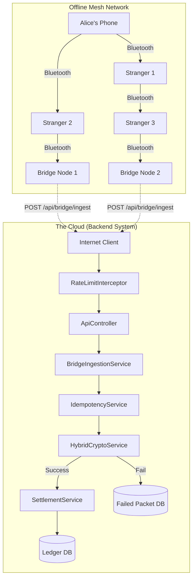
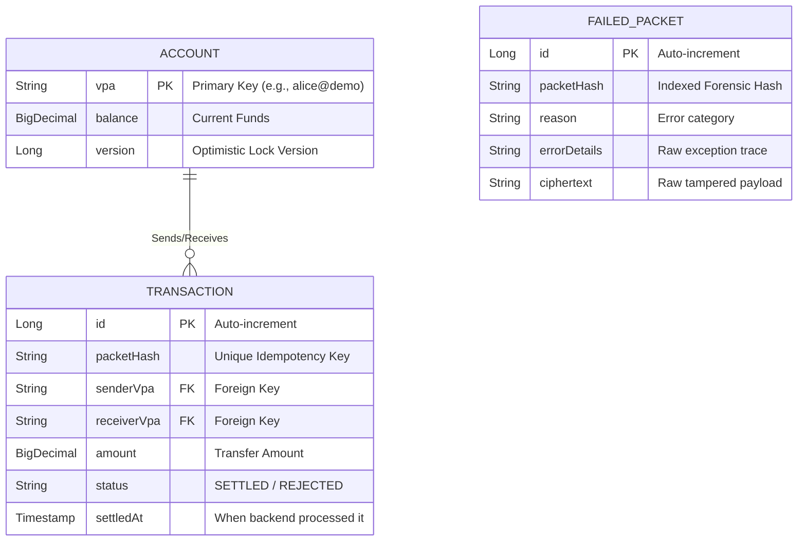

<p align="center">
  
  
  
  
  
  
</p>

# Offline UPI Mesh System

Offline UPI Mesh System is a distributed systems simulation that enables secure financial transactions without internet connectivity.

Transactions propagate through a gossip-based mesh network, are collected by internet-enabled bridge nodes, and are settled exactly once using cryptographic security, idempotency controls, optimistic locking, and rate limiting.

---

## Screenshots

### Dashboard


### Mesh Simulation


### H2 Ledger


---

## Project Status

✅ Multiple Bridge Nodes  
✅ Duplicate Storm Handling  
✅ Dead Letter Queue  
✅ Pagination  
✅ Token Bucket Rate Limiting  

🚧 **Future Work**
- Redis-backed Idempotency
- JWT Authentication
- Kafka Settlement Pipeline

---

## Engineering Highlights

- Hybrid Cryptography (RSA + AES)
- Duplicate Storm Protection
- Dead Letter Queue
- Optimistic Locking
- Token Bucket Rate Limiting
- Database Pagination
- Concurrent Multi-Bridge Simulation

---

## Tech Stack

| Category | Technology |
|-----------|------------|
| Language | Java 21 |
| Framework | Spring Boot |
| Database | H2 |
| ORM | Hibernate / JPA |
| Security | RSA-2048, AES-256-GCM |
| Concurrency | `ConcurrentHashMap` |
| Build Tool | Maven |
| Testing | JUnit 5 |

---

## Table of Contents
1. [Key Features](#key-features)
2. [Complete System Architecture](#complete-system-architecture)
3. [Database ER Diagram](#database-er-diagram)
4. [Project Folder Structure](#project-folder-structure)
5. [Local Setup (Quick Start)](#local-setup)
6. [The Three Hard Problems (And How They Are Solved)](#the-three-hard-problems)
7. [File-by-File Walkthrough](#file-by-file-walkthrough)
8. [Demo Flow & Explanation](#demo-flow-and-explanation)
9. [What's NOT Real (Production Differences)](#whats-not-real-and-what-would-change-for-production)
10. [Future Enhancements](#future-enhancements)
11. [API Documentation](#api-documentation)

---

## Key Features

| Feature | Description |
|----------|-------------|
| **Hybrid Encryption** | RSA-2048 + AES-256-GCM |
| **Multiple Bridge Nodes** | Simulates duplicate delivery storms |
| **Idempotent Settlement** | Prevents double spending |
| **Failed Packet Audit Log** | Dead Letter Queue for tampered data |
| **Token Bucket Rate Limiting** | API abuse protection |
| **Ledger Pagination** | OOM-resistant transaction API |

---

## Complete System Architecture

The architecture bridges the simulated offline mesh environment with the production-ready backend settlement engine.



---

## Database ER Diagram

The system uses an in-memory H2 database with three core entities, tied together with foreign keys and optimistic locking mechanisms to prevent race conditions.



---

## Project Folder Structure

The application follows standard Spring Boot architectural layers to ensure clean separation of concerns.

```text
src/main/java/com/demo/upimesh
├── config/                  # MVC Configuration and Rate Limit Interceptors
├── controller/              # Public REST APIs
├── crypto/                  # Cryptography Engine (AES/RSA)
├── model/                   # Database Entities & JPA Repositories
└── service/                 # Business Logic & Orchestration
src/main/resources
└── application.properties   # App & DB Configuration
```

---

## Local Setup

Follow these instructions to run the mesh simulator on your local machine.

### Prerequisites
* Java 17 or higher
* Maven (included via `./mvnw` wrapper)

### Installation
1. Clone the repository:
   ```bash
   git clone https://github.com/yourusername/offline-upi-mesh.git
   cd offline-upi-mesh
   ```
2. Build the project:
   ```bash
   ./mvnw clean install
   ```
3. Run the Spring Boot application:
   ```bash
   ./mvnw spring-boot:run
   ```
4. Access the in-memory H2 Database Console:
   * **URL:** `http://localhost:8080/h2-console`
   * **JDBC URL:** `jdbc:h2:mem:upimesh`
   * **User:** `sa` (Leave password blank)

---

## The Three Hard Problems

Building an offline financial network introduces massive security and concurrency risks. Here is an engineering discussion on how we solved them.

### Problem 1: Untrusted intermediates
A random stranger's phone is carrying your transaction. How do you stop them from reading the amount or changing it?

**Solution: Hybrid encryption (RSA-OAEP + AES-GCM).**

The sender encrypts the payload with the server's public key. Only the server holds the private key, so intermediates see opaque ciphertext.

But RSA can only encrypt small data (~245 bytes for a 2048-bit key), and our payload is JSON that could exceed that. So we use the standard hybrid pattern:
1. Generate a fresh AES-256 key for this packet.
2. Encrypt the JSON with AES-256-GCM (fast + authenticated).
3. Encrypt just the AES key with RSA-OAEP.
4. Concatenate: `[256 bytes RSA-encrypted AES key][12 bytes IV][AES ciphertext + 16-byte GCM tag]`.

Why GCM specifically? It's authenticated encryption. If an intermediate flips one bit anywhere in the ciphertext, decryption throws an exception — the GCM tag won't verify. The server cannot be tricked into processing tampered data. 

*(See `HybridCryptoService.java`)*

### Problem 2: The duplicate-storm
Three bridge nodes hold the same packet. They all walk outside at the same instant. They all POST to `/api/bridge/ingest` within milliseconds of each other. If you naively process all three, the sender is debited ₹1500 instead of ₹500.

**Solution: Atomic compare-and-set on the ciphertext hash.**

The very first thing the server does on receiving a packet is compute `SHA-256(ciphertext)` and try to "claim" that hash:

```java
// IdempotencyService.java
Instant prev = seen.putIfAbsent(packetHash, now);
return prev == null;  // true = first claimer, false = duplicate
```

`ConcurrentHashMap.putIfAbsent` is atomic. Even if 100 threads call it at the exact same nanosecond, exactly one returns null (the first claimer) and the rest return the existing entry. Only the first claimer proceeds to decrypt and settle. The rest are short-circuited as `DUPLICATE_DROPPED`.

Why hash the ciphertext, not the packetId or the cleartext?
* `packetId` can be rewritten by a malicious intermediate. Two copies of the same payment could have different packetIds. Bad key.
* The cleartext requires decryption first. We want to dedupe before spending CPU on RSA.
* The ciphertext is authenticated by GCM, so any tampering is detectable on decrypt. Two legitimate deliveries of the same payment have byte-identical ciphertexts (AES is deterministic for a given key+IV+plaintext, and the same packet means the same key+IV+plaintext).

*Note: In production this ConcurrentHashMap becomes Redis: `SET key NX EX 86400`. Same semantics, distributed across replicas.*

There's also a defense-in-depth fallback: `transactions.packet_hash` has a unique index. If the cache layer ever fails and two settlements somehow try to write the same hash, the database rejects the second one.

### Problem 3: Replay attacks
An attacker who captured a ciphertext weeks ago could replay it whenever convenient.

**Solution: Two layers of freshness.**

1. Inside the encrypted payload, the sender includes `signedAt` (epoch millis). The server rejects any packet older than 24 hours. The attacker can't change `signedAt` without breaking the GCM tag.
2. Inside the encrypted payload, the sender includes a nonce (UUID). Even if Alice legitimately sends Bob ₹100 twice, the nonces differ → ciphertexts differ → hashes differ → both settle. But a replay of one specific signed packet is byte-identical, so the idempotency cache catches it.

*(See `BridgeIngestionService.java` for the freshness check)*

---

## File-by-File Walkthrough

Here is a breakdown of the critical files driving the backend engine:

### 1. `HybridCryptoService.java`
The cryptographic vault. It implements AES-256-GCM and RSA-2048-OAEP. It handles the concatenation of IVs, Encrypted AES Keys, and GCM Tags into a single Base64 string payload.

### 2. `IdempotencyService.java`
The deduplication layer. Protects against duplicate storms using an atomic `ConcurrentHashMap`.

### 3. `BridgeIngestionService.java`
The core business pipeline. When a packet arrives, this service orchestrates the flow:
1. Hash the ciphertext.
2. Check Idempotency.
3. Decrypt Payload.
4. Validate Freshness (24h TTL).
5. Route to Settlement or send to the Dead Letter Queue.

### 4. `SettlementService.java`
The transactional ledger. Marked with `@Transactional`, it performs the actual database reads, verifies account balances, deducts the sender, credits the receiver, and writes the `Transaction` entity.

### 5. `RateLimiter.java` & `RateLimitInterceptor.java`
The security gate. A mathematical Token Bucket implementation that inspects incoming IPs and enforces a strict limit to prevent CPU exhaustion.

### 6. `MeshSimulatorService.java`
The laboratory. Since we aren't deploying code to physical Android phones, this service mathematically simulates how packets are generated, how they jump between offline devices (gossip), and how bridge nodes gather them.

---

## Demo Flow and Explanation

The mesh network requires a physical environment to truly work. Because we are testing locally, we simulate the physics using three dedicated REST endpoints in the `ApiController`.

### Step 1: `POST /api/demo/send`
* **What it simulates:** Alice is at a concert with no internet. She types Bob's VPA, enters ₹100, and hits "Pay".
* **What happens internally:** The backend acts as Alice's phone. It generates the JSON, generates a random AES key, encrypts everything using the Bank's Public Key, and drops the encrypted `MeshPacket` into Alice's "offline outbox".

### Step 2: `POST /api/mesh/gossip`
* **What it simulates:** Alice physically walks past Charlie. Charlie walks past Dave. Bluetooth radios ping each other.
* **What happens internally:** The `MeshSimulatorService` iterates through all simulated phones and mathematically copies packets from one phone's outbox to another phone's outbox. As you call this endpoint repeatedly, the packet exponentially spreads until it lands in the outboxes of the `Bridge Nodes`.

### Step 3: `POST /api/mesh/flush`
* **What it simulates:** The concert ends. People leave the stadium and their phones connect to 4G cell towers.
* **What happens internally:** All Bridge Nodes simultaneously execute parallel threads, blasting their entire outboxes at the `/api/bridge/ingest` endpoint. You will watch the `IdempotencyService` catch the duplicate uploads in real-time, allowing exactly one transaction to settle.

---

## What's NOT Real (And What Would Change For Production)

This is a teaching demo. To make it production-grade you'd swap these things:

| What's in the demo | What it would be in production |
| :--- | :--- |
| H2 in-memory DB | PostgreSQL / MySQL with replicas |
| `ConcurrentHashMap` for idempotency | Redis with `SET NX EX` |
| RSA keypair regenerated on every startup | Private key in HSM (AWS KMS, HashiCorp Vault). Public key cached on devices. |
| Server-side `DemoService.createPacket()` | Same code running on Android, in a Kotlin port |
| Software-simulated mesh (`MeshSimulatorService`) | Real BLE GATT or Wi-Fi Direct between physical phones |
| One settlement service that owns the ledger | Integration with NPCI / a real bank core |
| No auth on `/api/bridge/ingest` | Mutual TLS or signed bridge-node certificates |
| In-memory accounts seeded on startup | Real KYC'd users, real VPAs, real PIN verification against the bank |
| API Rate Limiting (In-Memory Token Bucket) | Distributed API Gateway (Kong, AWS API Gateway) with Redis backing |
| Logs to console | Structured logs to a SIEM, alerts on `INVALID` spikes |

The cryptography and idempotency code is essentially production-shaped. The infrastructure around it is what changes.

---

## Future Enhancements

* **Elliptic Curve Cryptography (ECC):** Migrate from RSA to ECC (e.g., Ed25519) to dramatically reduce the byte-size of the cryptographic signatures and keys, optimizing Bluetooth low-energy transfer speeds.
* **Distributed Idempotency:** Replace the local `ConcurrentHashMap` with a Redis cluster to allow the ingestion API to horizontally scale across multiple instances.
* **Kafka Event-Driven Settlement:** Decouple ingestion from settlement. The ingestion API should merely validate the crypto and publish the payload to an Apache Kafka topic, allowing backend worker nodes to process ledger updates asynchronously.
* **JWT Bridge Authentication:** Implement JSON Web Tokens to mathematically verify the identity of the Bridge Nodes uploading the packets.

---

## API Documentation

### 1. Ingest Packet (Production Bridge)
The endpoint where bridge nodes upload collected packets.
* **URL:** `/api/bridge/ingest`
* **Method:** `POST`
* **Body:** 
  ```json
  {
    "ciphertext": "base64_encoded_string_...",
    "packetId": "uuid-string",
    "ttl": 5
  }
  ```
* **Success Response:** `200 OK` 
  ```json
  { "outcome": "SETTLED", "packetHash": "e3b0c442...", "transactionId": 12 }
  ```
* **Duplicate Response:** `200 OK` (Outcome: `DUPLICATE_DROPPED`)
* **Rate Limit Response:** `429 Too Many Requests`

### 2. View Ledger (Paginated)
Fetch settled transactions safely.
* **URL:** `/api/transactions?page=0&size=5`
* **Method:** `GET`
* **Response:**
  ```json
  {
    "content": [
      { "id": 12, "senderVpa": "alice@demo", "amount": 50.00 }
    ],
    "totalPages": 5,
    "totalElements": 25,
    "size": 5
  }
  ```
