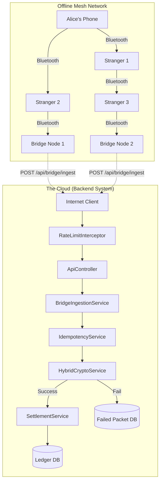
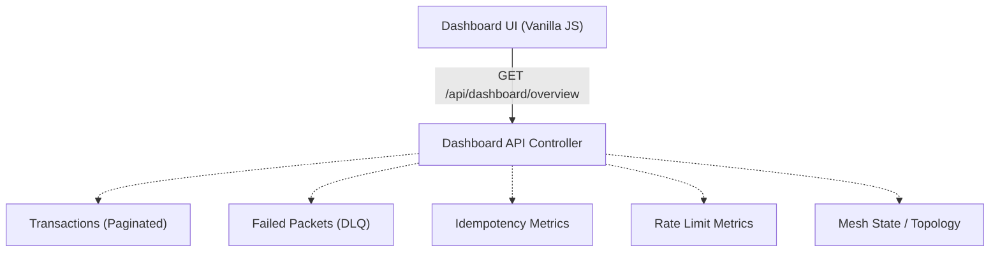

<p align="center">
  
  
  
  
  
  
</p>

# Offline UPI Mesh System

## Table of Contents
1. [Overview](#overview)
2. [Dashboard Preview](#dashboard-preview)
3. [Real World Use Cases](#real-world-use-cases)
4. [Problem Statement](#problem-statement)
5. [Engineering Highlights](#engineering-highlights)
6. [Complete System Architecture](#complete-system-architecture)
7. [Dashboard Architecture](#dashboard-architecture)
8. [Evolution of the System](#evolution-of-the-system)
9. [Features](#features)
10. [Observability Dashboard](#observability-dashboard)
11. [Tech Stack](#tech-stack)
12. [Project Structure](#project-structure)
13. [API Documentation](#api-documentation)
14. [Security Features](#security-features)
15. [Reliability Features](#reliability-features)
16. [Scalability Features](#scalability-features)
17. [Testing & Validation](#testing--validation)
18. [Running Locally](#running-locally)
19. [Example Demo Flow](#example-demo-flow)
20. [Current Limitations](#current-limitations)
21. [Future Improvements](#future-improvements)
22. [Resume Highlights](#resume-highlights)
23. [Interview Talking Points](#interview-talking-points)
24. [License](#license)

---

## Overview

Offline UPI Mesh System is a distributed systems simulation that enables secure financial transactions without internet connectivity.

Transactions propagate through a gossip-based mesh network, are collected by internet-enabled bridge nodes, and are settled exactly once using cryptographic security, idempotency controls, optimistic locking, and rate limiting.

---

## Dashboard Preview

### System Overview


Professional observability console showing:

- System health
- Mesh topology
- Duplicate protection metrics
- Rate limit metrics
- Security forensics
- Account balances
- Paginated ledger

---

## Real World Use Cases

- Natural disaster zones
- Rural banking
- Underground transport systems
- Large concerts
- Military field operations
- Remote villages

---

## Problem Statement

Building an offline financial network introduces massive security and concurrency risks. We specifically aim to solve three hard problems:

1. **Untrusted Intermediates:** A random stranger's phone is carrying your transaction. We must stop them from reading the amount or changing it.
2. **The Duplicate Storm:** If three bridge nodes hold the same packet and simultaneously reach the internet, they will all upload the same packet concurrently. Naive processing leads to double spending.
3. **Replay Attacks:** An attacker who captured a ciphertext weeks ago could replay it whenever convenient to repeatedly drain funds.

---

## Engineering Highlights

- RSA-2048 Hybrid Encryption
- AES-256-GCM Authenticated Encryption
- O(1) Duplicate Detection
- Concurrent Multi-Bridge Upload Simulation
- Token Bucket Rate Limiting
- Paginated Ledger API
- Dead Letter Queue
- Optimistic Locking
- Observability Dashboard

---

## Complete System Architecture

The architecture bridges the simulated offline mesh environment with the production-ready backend settlement engine.



---

## Dashboard Architecture



---

## Evolution of the System

- **Version 1:** Basic settlement
- **Version 2:** Multi bridge nodes
- **Version 3:** Idempotency engine
- **Version 4:** Dead Letter Queue
- **Version 5:** Token Bucket Rate Limiting
- **Version 6:** Observability Dashboard

---

## Features

| Feature | Description |
|----------|-------------|
| **Hybrid Encryption** | RSA-2048 + AES-256-GCM |
| **Multiple Bridge Nodes** | Simulates duplicate delivery storms |
| **Idempotent Settlement** | Prevents double spending |
| **Failed Packet Audit Log** | Dead Letter Queue for tampered data |
| **Token Bucket Rate Limiting** | API abuse protection |
| **Ledger Pagination** | OOM-resistant transaction API |
| **Observability Console** | Visual metrics and Mesh Network topologies |

---

## Observability Dashboard

The dashboard exposes:

- Total Settled Transactions
- Total Settled Volume
- Duplicate Packets Blocked
- Rate Limits Triggered
- Failed Packet Count
- Mesh Topology
- Security Forensics
- Account Balances
- Transaction Ledger

It provides a dynamic **System Health Indicator**:
- 🟢 **HEALTHY:** Bridge network is online and no recent packet anomalies.
- 🟡 **DEGRADED:** System is settling packets, but anomalies exist (DLQ is capturing failures).
- 🔴 **CRITICAL:** Total mesh disconnect. No bridge nodes have internet access.

---

## Tech Stack

| Category | Technology |
|-----------|------------|
| Language | Java 21 |
| Framework | Spring Boot |
| Database | H2 |
| ORM | Hibernate / JPA |
| Security | RSA-2048, AES-256-GCM |
| Concurrency | `ConcurrentHashMap`, `AtomicInteger` |
| Build Tool | Maven |
| Testing | JUnit 5 |
| Frontend | HTML, Vanilla JS, Vanilla CSS |

---

## Project Structure

```text
src/main/java/com/demo/upimesh
├── config/                  # MVC Configuration and Rate Limit Interceptors
├── controller/              # Public REST APIs and Web UI routing
├── crypto/                  # Cryptography Engine (AES/RSA)
├── model/                   # Database Entities & JPA Repositories
└── service/                 # Business Logic, Health Service & Orchestration
src/main/resources
├── application.properties   # App & DB Configuration
├── static/                  # Frontend styling (CSS) and logic
└── templates/               # Thymeleaf views (dashboard.html)
```

---

## API Documentation

### 1. Ingest Packet (Production Bridge)
The endpoint where bridge nodes upload collected packets.
* **URL:** `/api/bridge/ingest`
* **Method:** `POST`
* **Body:** 
  ```json
  {
    "ciphertext": "base64_encoded_string_...",
    "packetId": "uuid-string",
    "ttl": 5
  }
  ```
* **Success Response:** `200 OK` 
  ```json
  { "outcome": "SETTLED", "packetHash": "e3b0c442...", "transactionId": 12 }
  ```
* **Duplicate Response:** `200 OK` (Outcome: `DUPLICATE_DROPPED`)
* **Rate Limit Response:** `429 Too Many Requests`

### 2. View Ledger (Paginated)
Fetch settled transactions safely.
* **URL:** `/api/transactions?page=0&size=5`
* **Method:** `GET`
* **Response:**
  ```json
  {
    "content": [
      { "id": 12, "senderVpa": "alice@demo", "amount": 50.00 }
    ],
    "totalPages": 5,
    "totalElements": 25,
    "size": 5
  }
  ```

---

## Security Features

1. **Hybrid Encryption (RSA-OAEP + AES-GCM):** The sender encrypts the payload with the server's public key. Only the server holds the private key, so intermediates see opaque ciphertext. AES-256-GCM is used for authenticated encryption, meaning any bit flipping by intermediaries results in immediate decryption failure (tampered packet detection).
2. **Replay Attack Prevention:** Packets contain a `signedAt` epoch and a TTL. The server checks freshness (max 24 hours). Inside the payload, a `packetId` (UUID) prevents genuine packets from being replayed infinitely.
3. **API Abuse Protection:** Rate limiting via the Token Bucket algorithm controls API ingest volume from physical IPs.

---

## Reliability Features

1. **Idempotent Settlement Engine:** Uses `ConcurrentHashMap.putIfAbsent` to atomically lock on `SHA-256(ciphertext)`. This ensures exactly-once processing even if 100 bridge nodes upload the same transaction simultaneously.
2. **Optimistic Locking:** JPA `@Version` on Account entities prevents concurrent transaction settlements from creating negative balance anomalies or overwriting read states.
3. **Dead Letter Queue (DLQ):** Packets that fail decryption, TTL checks, or internal logic are captured and written to a `FailedPacket` table for audit and forensic review, preventing silent data loss.

---

## Scalability Features

1. **Database Pagination:** Ledger fetches use Spring Data's `Pageable` standard to chunk queries. This prevents `OutOfMemoryError` (OOM) when millions of transactions are recorded.
2. **Stateless Idempotency Potential:** The current `ConcurrentHashMap` can be swapped 1:1 with Redis `SET NX EX` to enable horizontal scaling of API nodes.
3. **O(1) Rate Limiting Cleanup:** Inactive rate limiting buckets are cleared lazily via `@Scheduled` tasks to prevent long-running processes from memory leaking.

---

## Testing & Validation

The system's integrity has been rigorously verified through:

* **Dashboard validation:** Real-time polling guarantees state visualization matches database records.
* **H2 database validation:** Inserts, atomic locks, and relations verified locally.
* **API testing using `curl`:** Manual ingestion tests.
* **Duplicate storm testing:** Concurrency threads triggering `/api/mesh/flush` successfully rejected all but one packet.
* **Rate limit testing:** Verified 429 response enforcement correctly triggers.
* **DLQ testing:** Ingesting modified ciphertexts correctly logs to the Failed Packets table without crashing the thread.
* **Pagination testing:** Verified ledger endpoint boundaries and stability.

---

## Running Locally

### Prerequisites
* Java 17 or higher
* Maven (included via `./mvnw` wrapper)

### Installation
1. Clone the repository:
   ```bash
   git clone https://github.com/yourusername/offline-upi-mesh.git
   cd offline-upi-mesh
   ```
2. Build the project:
   ```bash
   ./mvnw clean install
   ```
3. Run the Spring Boot application:
   ```bash
   ./mvnw spring-boot:run
   ```
4. Access the Dashboard: `http://localhost:8080/dashboard`
5. Access the H2 Database Console:
   * **URL:** `http://localhost:8080/h2-console`
   * **JDBC URL:** `jdbc:h2:mem:upimesh`
   * **User:** `sa` (Leave password blank)

---

## Example Demo Flow

The mesh network requires a physical environment to truly work. We simulate the physics locally using three dedicated REST endpoints in the `ApiController`.

### Step 1: `POST /api/demo/send`
* **What it simulates:** Alice is at a concert with no internet. She types Bob's VPA, enters ₹100, and hits "Pay".
* **What happens internally:** The backend acts as Alice's phone. It encrypts everything using the Bank's Public Key, and drops the encrypted `MeshPacket` into Alice's "offline outbox".

### Step 2: `POST /api/mesh/gossip`
* **What it simulates:** Alice physically walks past Charlie. Charlie walks past Dave. Bluetooth radios ping each other.
* **What happens internally:** Packets exponentially spread from device to device until they reach `Bridge Nodes`.

### Step 3: `POST /api/mesh/flush`
* **What it simulates:** The concert ends. People leave the stadium and their phones connect to 4G cell towers.
* **What happens internally:** All Bridge Nodes simultaneously blast their outboxes at the `/api/bridge/ingest` endpoint. The `IdempotencyService` catches the duplicate uploads in real-time, allowing exactly one transaction to settle.

---

## Current Limitations

This is a functional prototype. To make it production-grade you'd swap these things:

| What's in the demo | What it would be in production |
| :--- | :--- |
| H2 in-memory DB | PostgreSQL / MySQL with read replicas |
| `ConcurrentHashMap` for idempotency | Redis with `SET NX EX` |
| RSA keypair regenerated on every startup | Private key in HSM (AWS KMS, HashiCorp Vault). Public key cached on devices. |
| Server-side `DemoService.createPacket()` | Same code running natively on an Android device |
| Software-simulated mesh | Real BLE GATT or Wi-Fi Direct between physical phones |
| One settlement service that owns the ledger | Integration with NPCI / a real bank core ledger |
| No auth on `/api/bridge/ingest` | Mutual TLS or signed bridge-node certificates |
| In-memory accounts seeded on startup | Real KYC'd users, real VPAs, real PIN verification |
| In-Memory Token Bucket | Distributed API Gateway (Kong, AWS API Gateway) |
| Console logging | Structured logs to a SIEM, alerts on `INVALID` spikes |

---

## Future Improvements

* **Elliptic Curve Cryptography (ECC):** Migrate from RSA to ECC (e.g., Ed25519) to dramatically reduce the byte-size of the cryptographic signatures and keys, optimizing Bluetooth low-energy transfer speeds.
* **Distributed Idempotency:** Replace the local `ConcurrentHashMap` with a Redis cluster to allow the ingestion API to horizontally scale across multiple instances.
* **Kafka Event-Driven Settlement:** Decouple ingestion from settlement. The ingestion API should merely validate the crypto and publish the payload to an Apache Kafka topic, allowing backend worker nodes to process ledger updates asynchronously.
* **JWT Bridge Authentication:** Implement JSON Web Tokens to mathematically verify the identity of the Bridge Nodes uploading the packets.

---

## Resume Highlights

- Built a distributed offline payment simulation using Java and Spring Boot.
- Implemented hybrid cryptography using RSA-2048 OAEP and AES-256-GCM.
- Designed a concurrent idempotency engine preventing duplicate settlements during multi-bridge upload storms.
- Engineered a custom Token Bucket rate limiter protecting ingestion APIs from abuse.
- Built a Datadog-style observability dashboard exposing security, reliability, and settlement metrics.

---


---

## License

MIT License
